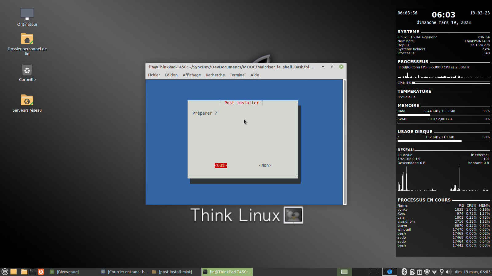

# Post-install Mint

Script to automate the installation of Mint with predefined software according to my needs.



## Installation

## Usage

```
chmod +x ./mint-post-install.sh
```

```
sudo ./mint-post-install.sh
```

## Contributing
[makeareadme](https://www.makeareadme.com/)

## License
